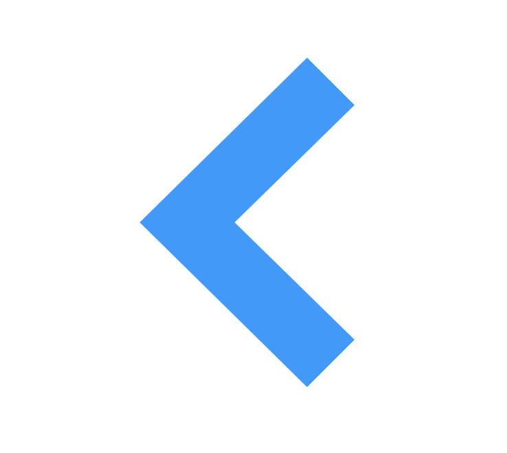

:name: DaVinci
:author: Elias Abel
:author_esc: Elias%20Abel
:mail: admin@meniny.cn
:desc: a more modern CoreGraphics wrapper for iOS/macOS.
:icon: {name}.png
:version: 1.0.2
:na: N/A
:ios: 10.0
:macos: 10.10
:watchos: {na}
:tvos: {na}
:linux: {na}
:xcode: 9.3
:swift: 4.1
:license: MIT
:sep: %20%7C%20
:platform: iOS{sep}macOS
= Meet `{name}`
{author} <{mail}>
v{version}, 2018-05-08

[subs="attributes"]
++++

  
    
  
  
  
   
  
  
  
   
  
  
  
  

++++

:toc:

== 🏵 Introduction

**{name}** is {desc}.

== 📋 Requirements

[%header]
|===
2+^m|Type 1+^m|Requirement

1.5+^.^|Platform ^|iOS ^|{ios}+
^|macOS ^e|{macos}
^|tvOS ^e|{tvos}
^|watchOS ^e|{watchos}
^|Linux ^e|{linux}

^|IDE ^|Xcode ^| {xcode}+
^|Language ^|Swift ^| {swift}+
|===

== 📲 Installation

=== CocoaPods

`{name}` is available on link:https://cocoapods.org[CocoaPods].

[source, ruby, subs="verbatim,attributes"]
----
use_frameworks!
pod '{name}'
----

=== Manually

Copy all files in the `{name}` directory into your project.

== 🛌 Dependency

{na}

== ❤️ Contribution

You are welcome to fork and submit pull requests.

== 🔖 License

`{name}` is open-sourced software, licensed under the link:./LICENSE.md[`{license}`] license.

== 🔫 Usage

.Sample.swift
[source, swift, subs="verbatim,attributes"]
----
import {name}

public func draw(in context: CGContext, rect: CGRect) {
    let fillColorOne: CGColor = #colorLiteral(red: 0.05, green:0.49, blue:0.98, alpha:0.8).cgColor
    func cal(_ ref: CGFloat, _ acu: CGFloat) -> CGFloat {
        let reference: CGFloat = 66
        return (ref / reference) * acu
    }

    let arrowPartTop = DaVinciPath.init(point: CGPoint.init(x: cal(11, rect.width), y: rect.midY))
        .addLine(to: CGPoint.init(x: cal(44.5, rect.width), y: 0))
        .addLine(to: CGPoint.init(x: cal(54, rect.width), y: cal(9.5, rect.height)))
        .addLine(to: CGPoint.init(x: cal(30, rect.width), y: rect.midY))
        .close()
    let arrowPartBottom = arrowPartTop.flip(.vertically, by: rect.midY)
    let arrow = arrowPartTop + arrowPartBottom

    context.fill(path: arrow, color: fillColorOne)
}
----

